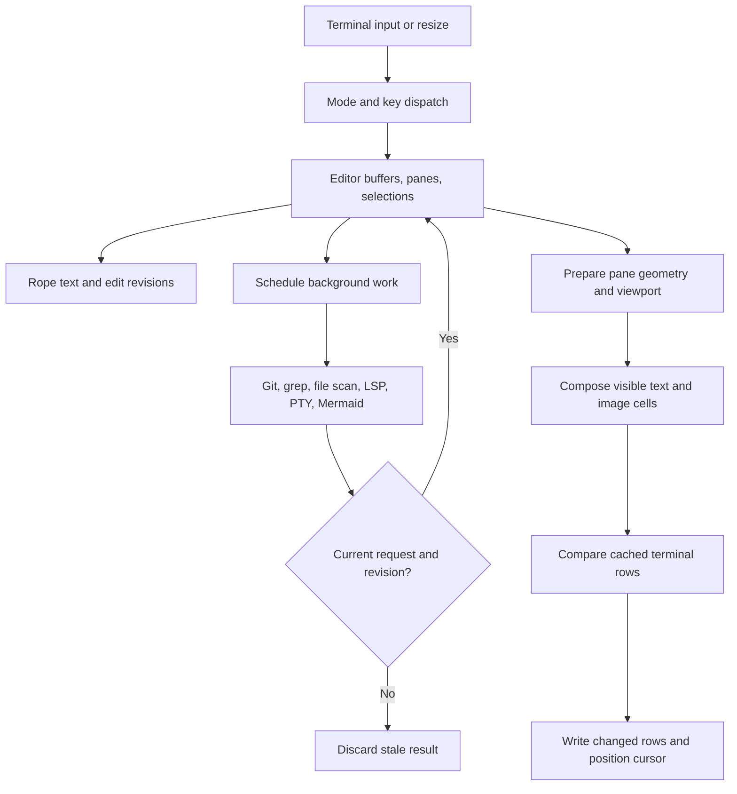

# Vaayu architecture

Source baseline: `4f1b81d`, reviewed 2026-10-08. [Change coverage](CHANGELOG.md) records every commit since the last broad documentation refresh. [Technical decisions](TECHNICAL_DECISIONS.md) explains the rendering algorithms; [benchmarks](BENCHMARKS.md) supplies measurements. Planned work lives in [the parity plan](NEOVIM_PARITY_PLAN.md), separately from this implemented architecture.

## Executables and runtime

Vaayu is a Rust 2021 application with two executable names, `vaayu` and `vy`. [The alias](src/bin/vy.rs) includes [the same main implementation](src/main.rs); their Rust test counts describe the same suite compiled twice. [Cargo.toml](Cargo.toml) enables optimized release builds with LTO, stripped symbols, and abort-on-panic. [rust-toolchain.toml](rust-toolchain.toml) pins Rust `1.99.0`, rustfmt, and Clippy. There is no Lua/plugin host.

Startup loads configuration, rolls overdue personal tasks forward, records the launch project, restores project shada, and opens the first file argument. The launch directory defines `project_root`; opening a file elsewhere does not implicitly change that root. `:projects` can switch the active project. The terminal guard restores terminal modes after normal exit and panic. See [main](src/main.rs), [projects](src/projects.rs), and [configuration](src/config.rs).

Each frame reads the actual terminal dimensions, prepares pane geometry, polls Mermaid work, refreshes necessary syntax/decorations/Git/LSP state, composes the screen, and starts any pending file scan. Idle polling wakes for background completions and deferred highlighting without requiring another key. Different integrations have their own job slots and lifecycle rules; a universal job supervisor remains planned. See [main loop](src/main.rs), [jobs](src/jobs.rs), and [progress](src/progress.rs).

## Text, input, and rendering

[Buffer](src/buffer.rs) owns Rope text, a stable ID, edit revision/log, saved baseline, undo transactions, folds, encoding, and file format. Text uses `\n` internally; save preserves supported encoding, BOM, and line-ending choices. [File writing](src/files.rs) replaces a temporary sibling atomically and checks external changes. Workspace text edits stay unsaved and undoable; file-resource operations preflight and attempt rollback, rather than claiming crash-atomic multi-file transactions.

Modes dispatch through [Editor](src/editor.rs). [Normal](src/normal.rs), [Insert](src/insert.rs), and [Visual](src/visual.rs) share operators, motions, registers, text objects, search, and repeat. [Actions](src/actions.rs) defines leader commands; [command](src/command.rs) defines Ex commands; [keymap](src/keymap.rs) handles declarative remaps. These registries feed discovery, but `HELP.md` is maintained text rather than generated documentation. See [command reference](COMMANDS.md) and [help](HELP.md).

[Renderer](src/render.rs) uses cell-aware glyphs and per-line, viewport, composed-row, and final-row caches. `PaneDims` supplies the same content geometry to viewport preparation and painting, including gutters, minimap, winbar, zen mode, and global statusline. Wrapped cursor placement selects the display row containing its actual column. Scroll reuse moves terminal rows where eligible, then repaints exposed/changed content. Focused tree and outline panes place a visible cursor on their selected row.

[Tree-sitter syntax](src/syntax.rs) uses incremental parses and highlight-span updates, with bounded/deferred fallback work. Grammars cover Rust, Python, JavaScript/JSX, TypeScript/TSX, Go, C, Bash, JSON, TOML, YAML, Lua, Vim, CSS, HTML, and Solidity. Above the default `large_file_kb = 5120` cutoff, tree-sitter, spell, TODO, and rainbow scans are skipped. Markdown preview parsing is a separate pulldown-cmark path, not a Markdown tree-sitter grammar. [Semantic tokens](src/language.rs) are optional LSP overlays.

## Panes, lists, and terminals

[Windows](src/windows.rs) uses recursive mixed-orientation splits, up to 32 panes, with independent cursor, viewport, preview position, and zoom state. Tabs retain their own layouts. Sessions save named-file layouts, tabs, positions, and folds; they do not resurrect terminal processes or save unsaved source text. Tree sidebars are pinned at a configured edge; the outline starts at 30% of the current pane width and remains resizable. `Ctrl-W` direction chords accept held Ctrl, including legacy `Backspace`/`Enter` encodings for `Ctrl-H`/`Ctrl-J`.

[Results](src/results.rs) unifies locations, diagnostics, comments, tasks, tests, Git/GitHub output, and actions. Quickfix snapshots preserve producer metadata so task mutations still work after export. `?` opens bounded, context-specific key help; `/` and `g?` search. Help and delete confirmation intercept input before global shortcuts. Picker and list query fields have Normal/Insert submodes; leader commands remain available outside text entry.

[PTY sessions](src/pty.rs) combine `portable-pty` processes with a `vt100` screen and reader thread. Replies to supported terminal probes let interactive shells finish startup. Split terminals, lazygit, tool installers, and named agents reuse this subsystem. A floating shell uses the existing [float](src/float.rs) compositor: `Ctrl-\` hides/reattaches the same live PTY; `Esc` or `Ctrl-Q` closes it and stops its child. Named agents have their own detach/reattach semantics. Bracketed paste is used for context; the receiving CLI must understand it to treat multiline input as one paste.

## Background integrations

| Area | Implementation and lifecycle |
| --- | --- |
| File discovery and grep | [picker](src/picker.rs), [jobs](src/jobs.rs): cached asynchronous inventory, bounded top-500 path ranking, 60 ms grep debounce, generation cancellation, 5,000-result cap. |
| Filesystem changes | [watcher](src/watcher.rs): notify-based batches; clean buffers autoread, dirty buffers are flagged, tree listings invalidate, structural changes trigger rate-limited inventory refresh; polling/focus reload remain fallbacks. |
| LSP | [client](src/lsp/client.rs), [protocol](src/lsp/protocol.rs), [module](src/lsp/mod.rs), [language actions](src/language.rs): framed stdio, per-root clients, UTF-16 conversion, stable buffer/revision checks, cancellation/deadlines, multi-server configuration. |
| Project replacement | [far](src/far.rs): debounced per-line search/replace with globs, per-file/match selection, stale-line checks, and one undo step per affected buffer. |
| Git and GitHub | [gitdiff](src/gitdiff.rs), [Git workspace](src/gitworkspace.rs), [Git commands](src/git_tools.rs), [GitHub](src/github.rs): background output to shared Results; saved-file hunk actions; optional authenticated `gh` for read-first PR/issues/CI views and checkout. |
| Build and test commands | [task](src/task.rs), [testrun](src/testrun.rs): external runners, streamed output, quickfix failures, test signs, stop/re-run/watch actions. Personal tasks use a separate store. |
| Progress | [progress](src/progress.rs): 250 ms reveal delay, five-row stack, two-second completion linger; reconciles integration jobs rather than running them itself. |
| External tools | [tools](src/tools.rs), [SchemaStore](src/schemastore.rs): optional language-server health/install actions and bundled JSON/YAML schema associations. |

## Private storage and task transactions

| Store | Location and responsibility |
| --- | --- |
| Review comments | `.vaayu/comments.json`; [notes](src/notes.rs), [review](src/review.rs). Versioned line/range/file anchors, conflict checks, file locks, resolved status, selected feedback export, retained agent output. |
| Recovery | `.vaayu/recovery/`; [recovery](src/recovery.rs). Idle snapshots of dirty project source, edited notes, and recognized personal task documents. Restores remain unsaved and refuse to replace a dirty buffer. |
| Persistent undo | `.vaayu/undo/`; [undofile](src/undofile.rs). Content-hash guarded saved undo history. |
| Project state | `.vaayu/shada.json`, `.vaayu/session.json`; [shada](src/shada.rs), [session](src/session.rs). Registers/history/marks/jumps/positions/tree state/tour resume; explicit pane/tab sessions. |
| Personal tasks | User data directory `vaayu/tasks/YYYY-MM-DD.toml`; [task tracker](src/task_tracker.rs). Cross-project version-1 day documents with stable IDs, capture timestamp, scheduled time, task/note kind, status, integer priority, multiline text/notes, and rollover identity. |
| Code tours | Project `.tours/*.tour`; [tour](src/tour.rs). CodeTour JSON and an editable scratch explanation buffer in a resizable bottom split. Generated tours are ordinary project files. |

Private stores use owner-only directory/file permissions on Unix and local ignore rules where applicable; they are plaintext. Tasks use `tasks.lock`, schema/date validation, expected-disk comparisons, and atomic single-file writes. Writes validate before and after save hooks; task save-as is refused. List completion/reopen/delete refuses unsaved day-buffer conflicts and revalidates confirmed deletion. Rollover writes today's copy first and uses `rollover_id` to finish interrupted moves without duplication; it is not an atomic transaction across two day files. [Task draft and persistence details](GUIDE.md#personal-task-tracker) describe the user workflow.

## Agents and tours

`ai_agent` chooses the named CLI used by `:ai`, `,ca`, `:toursave`, and `:tourexplain`; default is `"claude"`. `agent_commands` supplies executable/argument arrays, with a PATH-name fallback. `:claude`, `:codex`, and `:agent <name>` target their explicit names independently. A new AI sidebar waits for output quiescence before pasting queued context; an existing session is reused by ID. The human presses Enter to submit. Successful AI sends preserve the clipboard; launch failure copies the prompt to `+` and reports the failure. `,cx` explicitly copies and optionally sends its built context. [Context](src/context.rs) and [PTY](src/pty.rs) own those paths.

Tours retain source/explanation focus and divider size while changing steps. `K` switches focus; explanation text supports normal editing and scrolling, with edits remaining scratch state rather than automatically modifying `.tour` files. Copy-step includes source metadata and a permalink when available; copy-all exports JSON. Restart and shada-backed resume use the active/last tour. Tour draft saving reads the draft buffer by stable ID, requests a name when needed, and sends generation instructions through the configured CLI. See [tour implementation](src/tour.rs).

## Markdown and Mermaid

[markdown](src/markdown.rs) parses prose, tables, nested lists, links, highlighted code, and Mermaid fences. [mermaid](src/mermaid.rs) wraps pinned Merman `0.8.0` with a single lazy worker, 150 ms debounce, cooperative three-second deadline, stale-result rejection, and source/palette/output artifact keys. Document layouts are cached independently by buffer/width/zoom. Prose edits, scrolling, and zoom can reuse diagrams.

[graphics](src/graphics.rs) probes Kitty Unicode-placeholder capability, uploads PNG artifacts, tracks dimension-specific placement IDs, and frees unused images on close/resize/exit. Placeholder cells pass through normal row composition, so panes clip images and dialogs cover them. Automatic mode uses Unicode through tmux/screen and in WezTerm; forced `"kitty"` assumes placeholder support. Unsupported, degraded, incomplete, or over-budget layouts retain fenced source and a reason.

Limits: 64 KiB source and 800 parsed items per diagram; 64 artifacts/32 MiB cache; 16 MiB per PNG; bounded text/grid output; 1600×2200 logical-pixel fit at 1.5× raster scale; 256-cell placements per direction; 50–300% graphical zoom. Strict parsing/resource policy prevents interactive HTML labels and external resource loads. Cancellation is cooperative. See [the implementation report](MERMAID_PREVIEW_PLAN.md) for family coverage and terminal limitations, and [the gallery](examples/mermaid.md) for fixtures.

## Remaining source modules

The table completes the source inventory beyond modules linked above.

| Concern | Source |
| --- | --- |
| Keys, modes, events, mouse | [key](src/key.rs), [mode](src/mode.rs), [events](src/events.rs), [mouse](src/mouse.rs). |
| Editing primitives | [motion](src/motion.rs), [operator](src/operator.rs), [textobject](src/textobject.rs), [grapheme](src/grapheme.rs), [registers](src/registers.rs), [autopairs](src/autopairs.rs), [surround](src/surround.rs), [align](src/align.rs), [indent](src/indent.rs), [multicursor](src/multicursor.rs). |
| Search, queries, navigation | [search](src/search.rs), [Vim regex](src/vimregex.rs), [queryline](src/queryline.rs), [navigation](src/navigation.rs). |
| Language/UI auxiliaries | [completion](src/completion.rs), [snippet](src/snippet.rs), [outline](src/outline.rs), [filetree](src/filetree.rs), [theme](src/theme.rs), [spell](src/spell.rs), [clipboard](src/clipboard.rs), [preview](src/preview.rs). |
| Edits, diff, conflicts | [resources](src/resources.rs), [diff](src/diff.rs), [conflict](src/conflict.rs). |
| Instrumentation and fixtures | [profile](src/profile.rs), [regression](src/regression.rs), [graphics diacritics](src/graphics_diacritics.rs). |

## Validation and limits

[Development](DEVELOPMENT.md) records the current checks and isolated-state instructions; [audit](AUDIT.md) distinguishes current findings from historical ones. [Benchmarks](BENCHMARKS.md) distinguishes first output, quiet-window output, warmed formatting, binary size, and historical hardware. A passing test suite does not establish full Vim, Mermaid.js, terminal, or plugin compatibility. DAP, complete GitHub mutation workflows, provider-backed inline suggestions, universal jobs, and general Markdown images remain outside the shipped capabilities.
