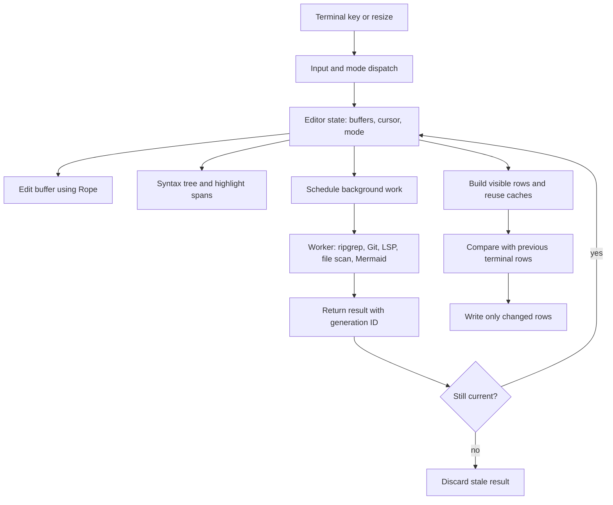

# Vaayu technical decisions and performance guide

Reviewed against `4f1b81d` on 2026-10-08. The implemented runtime and complete module inventory are in [ARCHITECTURE.md](ARCHITECTURE.md); [CHANGELOG.md](CHANGELOG.md) accounts for every post-refresh commit. Historical benchmark values are explicitly dated below; current measurements are in [BENCHMARKS.md](BENCHMARKS.md).

This guide explains the main implementation choices in Vaayu, the reasons behind them, and what the available measurements say. It is written for readers who may not know editor internals. Source links point to this checkout; benchmark data and method are in [BENCHMARKS.md](BENCHMARKS.md).

## How to read performance claims

“Faster” below means a lower median **key-to-first-output** time in the specified benchmark. The benchmark writes a key to a pseudo-terminal (PTY) and measures when the editor first writes output. It does not measure when the terminal has finished painting the screen or when a human sees the pixels. The historical comparison dated 2026-10-03 used a 50,000-line generated Rust file, a 100×40 terminal, a 4-vCPU Linux container, and three back-to-back runs. See the [raw data](bench/editor-comparison-2026-10-03.json) and [harness](bench/editor_compare.py).

The comparison is a sample of operations, not proof that one editor is universally faster. Numbers can move with machine, terminal, file, configuration, cache state, and version. Neovim was run bare (`-u NONE`); Helix ran with its Rust language server disabled; Vaayu's LSP was disabled. Bare Neovim has no comparable built-in project picker in this setup.

## Current measured results — 2026-10-08

The current source baseline is `4f1b81d` (rebuilt with the documentation-only embedded help update). The local i9-12900K run used three sequential 50,000-line, 100×40 PTY comparisons with Neovim `0.12.5` bare and Helix `25.07.1`, with Rust LSP disabled and isolated state. Medians below are medians of each run's median, in milliseconds. [Full method, source baseline, hashes and raw results](BENCHMARKS.md#current-refresh--2026-10-08) are available for verification.

| Operation (ms) | Vaayu | Neovim bare | Helix |
| --- | ---: | ---: | ---: |
| Cursor down | 1.001 | 0.504 | 3.178 |
| Page scroll | 0.654 | 0.484 | 3.165 |
| Enter Insert | 0.567 | 0.537 | 3.004 |
| Insert character | 0.794 | 0.887 | 177.195 |
| Leave Insert | 0.811 | 50.805 | 0.754 |
| Submit buffer search | 0.319 | 3.404 | 2.135 |
| Next search match | 2.501 | 0.507 | 4.404 |
| Open project picker | 0.559 | n/a | 3.600 |
| Filter project picker | 0.901 | n/a | 3.851 |
| Close project picker | 0.707 | n/a | 2.945 |
| Open live grep | 1.083 | n/a | 3.637 |
| Filter live grep | 0.483 | n/a | 3.011 |

Against the same-machine `e3a1b3a` release from the last broad documentation refresh, large-buffer insertion moved from 0.848 to 0.794 ms and live-grep opening from 0.944 to 1.083 ms. Median startup moved from 8.049 to 7.190 ms, RSS from 60.117 to 63.176 MiB, and binary size from 16.276 to 36.619 MiB. The fixed-source workload's p50/p99 rose from 1.057/8.713 to 1.105/9.228 ms, while Insert entry improved from 7.623 to 2.682 ms. This is mixed measured behavior; no causal feature attribution or universal speed claim follows. [Baseline comparison and tails](BENCHMARKS.md#same-machine-changes-since-the-documentation-baseline) give the complete evidence.

All core/editing comparisons had zero timeouts. Warm clangd formatting succeeded 5/5 times for every editor and measured 22.840/22.986/23.187 ms (Vaayu/Neovim/Helix), effectively tied at the harness's useful resolution. Native Mermaid cold diagram output measured 177.227 ms in Unicode mode and 303.840 ms with forced Kitty upload; cached reopening measured 13.597/26.127 ms across five processes per mode. Cold values include the 150 ms debounce; graphical checks use synthetic PTY bytes, not terminal painting. [Formatting](BENCHMARKS.md#warm-language-server-formatting) and [Mermaid](BENCHMARKS.md#native-mermaid-cold-and-cached-output) document the limits.

Historical comparisons below retain their original machine/date. The repaired two-step picker dismissal exposed an unverified UI-state assumption in older picker-close/grep timings; those historical labels should not establish current search-performance claims. [Harness reconciliation](BENCHMARKS.md#method-and-evidence) explains why.

## Runtime flow



Input updates editor state; expensive or external work can run separately; the renderer builds the visible screen and sends only the parts that differ. Background answers are checked before they can replace newer state.

## Decisions that affect responsiveness

### 1. Store editable text in a Rope

A Rope is a text structure split into pieces, with indexes that let the editor reach a character or line without treating the whole document as one long string. This is useful for editing because inserting or deleting text does not require shifting every later byte in one giant allocation. It does not make every operation constant-time: converting or exporting the whole document still visits the text.

```rust
// src/buffer.rs
pub fn insert_char(&mut self, line: usize, col: usize, ch: char) {
    let idx = self.char_idx(line, col);
    let edit_line = (ch == '\n').then(|| self.rope.char_to_line(idx));
    self.rope.insert_char(idx, ch);
    self.edit_seq += 1;
    self.log_edit(idx, 0, 1);
    if let Some(l) = edit_line {
        self.record_line_shift(l, 1);
    }
}
```

Code fences quote current source (common indentation removed); short excerpts may stop before surrounding blocks finish. The implementation updates the edit revision and edit log alongside the text so features can detect changed content. Vaayu uses the `ropey` crate ([dependency](Cargo.toml)). The historical 2026-10-03 benchmark measured character insertion at 0.70 ms for Vaayu, 0.82 ms for bare Neovim and 406.19 ms for Helix in this particular workload. That measurement is evidence for this case; it does not by itself prove Rope is the reason for the difference.

### 2. Update syntax information around the edit

Tree-sitter parses source code into a syntax tree. An incremental parse reuses unaffected parts of an earlier tree. Vaayu computes an edit, gives it to the old tree, and asks Tree-sitter to parse against that tree. Highlight spans are also updated only around changed tree ranges when possible.

```rust
// src/syntax.rs
if let Some(tree) = &mut self.tree {
    tree.edit(&edit);
}

let t1 = std::time::Instant::now();
let new_tree = self.parser.parse(new_text.as_bytes(), self.tree.as_ref());
crate::profile::note("syn_parse", t1.elapsed());

let t2 = std::time::Instant::now();
let incremental = match (&self.tree, &new_tree) {
    (Some(old), Some(new)) if !self.full_rebuild_pending => {
        compute_incremental_spans(&self.spans, self.lang, old, new, edit, &new_text)
    }
    _ => None,
};
```

The code comments record the motivation: parsing was already incremental, but walking the full syntax tree to rebuild every highlight span had cost about 8 ms per keystroke on a modest file in an earlier profile. `compute_incremental_spans` re-walks the affected region and reuses spans outside it. The 8 ms figure is historical profiling, not a current cross-editor comparison. On a large file, syntax work may be deferred briefly during active typing; the current fallback span rebuild throttle is 50 ms ([`src/syntax.rs`](src/syntax.rs)).

### 3. Cache rendered rows and write only differences

Vaayu builds screen rows in memory and compares them with the last rows it wrote. If a row is identical, it does not send it to the terminal again. A cache is saved work that can be reused when its inputs are unchanged.

```rust
// src/render.rs
for (y, row) in frame.iter().enumerate() {
    if cache.rows.get(y) != Some(row) {
        queue!(
            out,
            MoveTo(0, y as u16),
            ResetColor,
            SetAttribute(Attribute::Reset)
        )?;
```

The benchmark notes that a plain `3j` motion on a 100×40 screen went from a full-screen redraw to touching 4 rows and writing 358 bytes instead of roughly 4,000 cells ([benchmark notes](BENCHMARKS.md#what-was-fixed-in-the-order-found)). This is a concrete reduction in terminal output. The historical 2026-10-03 comparison measured cursor-down at 0.68 ms for Vaayu and 0.55 ms for Neovim, so the reduced output does not make Vaayu faster than every renderer or editor on every motion.

The cache also stores row composition by semantic row identity so that a row moved by scrolling can reuse its styled bytes. “Semantic” here means the row's content and display properties, rather than its screen coordinate ([`FrameCache`](src/render.rs)).

When the visible rows mostly match the prior frame shifted up or down, Vaayu can ask the terminal to move lines inside the editor area and repaint only the exposed rows ([scroll reuse](src/render.rs)). A terminal line move shifts already-painted cells; it avoids resending every row during a page movement. Neovim still measured slightly faster for page scroll in the 2026-10-03 run (0.56 ms vs 0.57 ms), so this mechanism reduces work without establishing a cross-editor win for that operation.

### 4. Keep only the best picker matches while scanning

For each typed query, a file picker scores candidate paths. A full sort would order every match and then throw almost all of them away because only 500 are shown. Vaayu instead retains the best 500 in a bounded heap, then sorts those survivors.

```rust
// src/picker.rs
let mut heap: BinaryHeap<Reverse<Scored>> = BinaryHeap::with_capacity(k + 1);
let mut matched = 0usize;
for (idx, f) in candidates.iter().enumerate() {
    let Some(base_score) = fuzzy_score(f, query) else {
        continue;
    };
    let score = base_score + boost.get(f.as_str()).copied().unwrap_or(0);
    matched += 1;
    let candidate = Scored {
        score,
        path: f,
        idx,
    };
    if heap.len() < k {
        heap.push(Reverse(candidate));
    } else if let Some(Reverse(worst)) = heap.peek() {
        if candidate > *worst {
            heap.pop();
            heap.push(Reverse(candidate));
        }
    }
}
let mut top: Vec<Scored> = heap.into_iter().map(|Reverse(s)| s).collect();
```

Here `n` is the number of candidate paths and `k` is the display limit (500). The old full sort costs about `n log n`; bounded selection costs about `n log k`, plus a final `k log k` sort. `log` describes how slowly the work grows as the input gets larger. Every path still has to be checked and scored, so this does not remove the `n` scan. It reduces the sorting and temporary storage. Earlier implementation notes include a brute-force equivalence check and a million-candidate timing experiment; those are historical local results, not the current editor-comparison table ([plan entry](NEOVIM_PARITY_PLAN.md)).

### 5. Run project search away from key handling

Live grep uses `ripgrep` in a worker thread. A 60 ms quiet period groups rapid query edits, and a generation number lets newer input invalidate older work. Results are capped at 5,000 entries. These choices keep process launch and file scanning out of the immediate keystroke path and stop obsolete results from taking over the current query.

```rust
// src/jobs.rs
self.search_job.generation.fetch_add(1, Ordering::Relaxed);
```

```rust
// src/jobs.rs
if generation.load(Ordering::Relaxed) != id || entries.len() >= 5000 {
    let _ = child.kill();
    break;
}
```

Asynchronous means the editor can continue handling input while the work runs. A generation is a counter attached to a request: if the current counter changes, the old request is stale. The historical 2026-10-03 “open live grep” and “filter live grep” values are first-output response times (0.41 ms and 0.43 ms); the harness did not observe a distinct delayed results update after the last filter key, since results were already onscreen. Those values describe input response, not the time required to search a project ([benchmark caveat](BENCHMARKS.md#vaayu-neovim-and-helix-after-the-feature-roadmap--2026-10-03)).

## Historical benchmark comparison — 2026-10-03

All values are milliseconds, median key-to-first-output, from the 2026-10-03 comparison. Difference is the comparator's time minus Vaayu's time; a positive number means Vaayu's first output was earlier. These are arithmetic differences from the rounded reported medians.

| Operation | Vaayu | Compared with | Difference | What the evidence supports |
|---|---:|---:|---:|---|
| Enter Insert | 0.60 | Neovim 0.63 | 0.03 | Near tie at this precision; do not call this a meaningful win. |
| Enter Insert | 0.60 | Helix 1.57 | 0.97 | Vaayu responded sooner in this run; the table alone does not identify the cause. |
| Insert character | 0.70 | Neovim 0.82 | 0.12 | Small observed difference. Rope storage and incremental editor work are plausible contributors, but this benchmark does not isolate them. |
| Insert character | 0.70 | Helix 406.19 | 405.49 | Large observed difference on this 50k-line test. The result was consistent across runs in the benchmark notes; no isolated experiment proves a specific code path caused it. |
| Leave Insert | 0.50 | Neovim 51.03 | 50.53 | The benchmark identifies Neovim's default 50 ms `ttimeoutlen` wait after Esc as the cause. This is a settings/protocol wait, not evidence that Vaayu's text edit is 100× faster. |
| Leave Insert | 0.50 | Helix 1.73 | 1.23 | Earlier first output in this workload; no causal attribution isolated. |
| Submit buffer search | 0.45 | Neovim 1.94 | 1.49 | Earlier response in this run; Vaayu's value measures first output, not completion of all possible search work. |
| Submit buffer search | 0.45 | Helix 1.76 | 1.31 | Earlier response in this run; implementation cause is not isolated. |
| Open project picker | 0.58 | Helix 1.81 | 1.23 | Vaayu's inventory is prewarmed asynchronously after the first frame (reported in earlier benchmark notes); this avoids waiting for the inventory at picker-open time. The 2026-10-03 harness did not see delayed inventory output after opening, so the data supports prompt opening, not end-to-end scan duration. |
| Filter project picker | 0.53 | Helix 2.31 | 1.78 | The bounded top-500 selection avoids fully sorting all matching paths, and cached inventory can be filtered locally. The comparison does not isolate the ranking algorithm's share of the difference. |
| Open live grep | 0.41 | Helix 1.93 | 1.52 | Search runs asynchronously, so opening can respond before file scanning finishes. This is key response latency, not completed search time. |
| Filter live grep | 0.43 | Helix 1.75 | 1.32 | Input gets a quick response while a debounced worker handles grep. The observed row is not a completed-result timing. |

Vaayu was **not** faster for every operation. In the same run, Neovim was quicker at startup (6–8 ms vs Vaayu's 15–29 ms), cursor down (0.55 vs 0.68), page scroll (0.56 vs 0.57), and next search match (0.63 vs 1.17). Neovim also used less idle memory (9.6 MiB vs 59.3 MiB). Entering Insert is a near tie with Neovim at the precision reported. Vaayu's advantage is operation-specific.

The source comparison's other limitations: startup had noisy Vaayu samples; there were only three runs; a 12 ms quiet-window proxy could not separate most single-key operations; no first-run/plugin-heavy comparison is represented; and measurements across the 2026-09-16 and 2026-10-03 runs are not directly comparable because the container changed. Formatting with clangd measured 22.685 ms for Vaayu, 22.640 ms for Neovim and 22.430 ms for Helix; the benchmark treats these as a tie below useful harness resolution ([BENCHMARKS.md](BENCHMARKS.md)).

## Architecture changes after that comparison

The historical key timings do not measure the task store, code tours, terminal startup, or diagram layout. Current [architecture](ARCHITECTURE.md) and [change coverage](CHANGELOG.md) describe these additions with source links:

- A private cross-project task store uses validated TOML, expected-disk snapshots, file locks, atomic day writes and stable rollover identity. Rollover spans two writes; it is not a multi-file atomic transaction.
- Floating terminals reuse live PTYs while hidden, and supported probe replies unblock interactive shell startup. Agent prompts/tours use a configured named CLI with argv commands and deferred bracketed paste.
- Source and tour explanation now use real resizable splits. `PaneDims` shares content geometry between viewport and paint; wrapped cursor selection follows the correct display segment. Outline width and focused sidebar cursors use the same layout.
- Mermaid parsing/layout/rasterization runs in a bounded native worker. Diagram artifacts cache by source/palette/output; per-width/zoom document layouts reuse them. Kitty Unicode placeholders allow image cells to follow ordinary row clipping, overlays, row comparison and lifecycle cleanup. Native rendering increases executable size; [current size and timings](BENCHMARKS.md) distinguish that cost from normal editing and historical prototype timings.

These choices explain mechanisms. Measurements do not isolate an individual mechanism's causal contribution unless the benchmark explicitly does so.

## Other engineering decisions

### Normalize text in memory, preserve file format on save

The buffer uses `\n` internally while recording whether a file used Unix, DOS, or old-Mac line endings. It also records the original encoding and byte order mark so the saved file can preserve those properties. This simplifies editing and line indexing without silently rewriting every file into a different format ([`FileFormat` and `Encoding`](src/buffer.rs)). This is a compatibility and correctness decision, not a measured speed claim.

### Replace files atomically when saving

`atomic_write` writes a temporary sibling file, syncs it, renames it over the destination, then attempts to sync the containing directory ([`src/files.rs`](src/files.rs)). In simple terms, the destination is replaced as one filesystem operation, reducing the chance that a crash leaves a half-written file. This is a reliability choice; no speed advantage is claimed.

## Small glossary

| Term | Plain-English meaning |
|---|---|
| Asynchronous | Work runs separately so input handling can continue. |
| Cache | Saved work reused when the relevant inputs have not changed. |
| Debounce | Wait briefly for input to pause, then do one piece of work instead of repeating it for each rapid keystroke. |
| Generation / stale result | A request counter marks newer work; an answer from an older counter is ignored. |
| Heap | A data structure that quickly exposes the current highest- or lowest-ranked item. |
| Incremental parse | Reuse the unchanged parts of a previous syntax tree and revisit the edited area. |
| Median | The middle value after sorting measurements; half of the samples are above and half below it. |
| O(n log n) | A shorthand for how work grows as the number of items `n` grows; a full sort grows faster than scanning while keeping a fixed-size best list. |
| PTY | A software terminal connection used to drive and observe an interactive program. |
| RSS | Resident set size: the amount of physical memory currently occupied by a process. |
| Rope | A text structure designed to support edits and lookups without storing the whole document as one flat string. |
| Semantic row signature | A description of what a rendered row contains, used to recognize reusable row output after scrolling. |
| Tree-sitter | A parser that builds a syntax tree and can update it after a localized edit. |
| First-output latency | Time from sending a key until the program writes its first response bytes; it is not the time until the screen is fully painted. |
| Atomic replace | Write a complete temporary file, then switch it into place as a single rename operation. |

## Sources

- [Benchmark report and caveats](BENCHMARKS.md)
- [Current raw results and provenance](bench/editor-comparison-2026-10-08.json)
- [Historical cross-editor results](bench/editor-comparison-2026-10-03.json)
- [Implemented architecture](ARCHITECTURE.md)
- [Complete change coverage](CHANGELOG.md)
- [PTY benchmark harness](bench/editor_compare.py)
- [Rendering implementation](src/render.rs)
- [Buffer implementation](src/buffer.rs)
- [Syntax implementation](src/syntax.rs)
- [Picker implementation](src/picker.rs)
- [Background jobs](src/jobs.rs)
- [File writing](src/files.rs)
