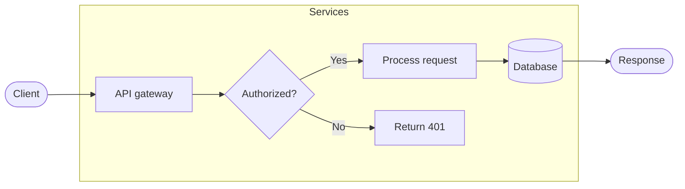
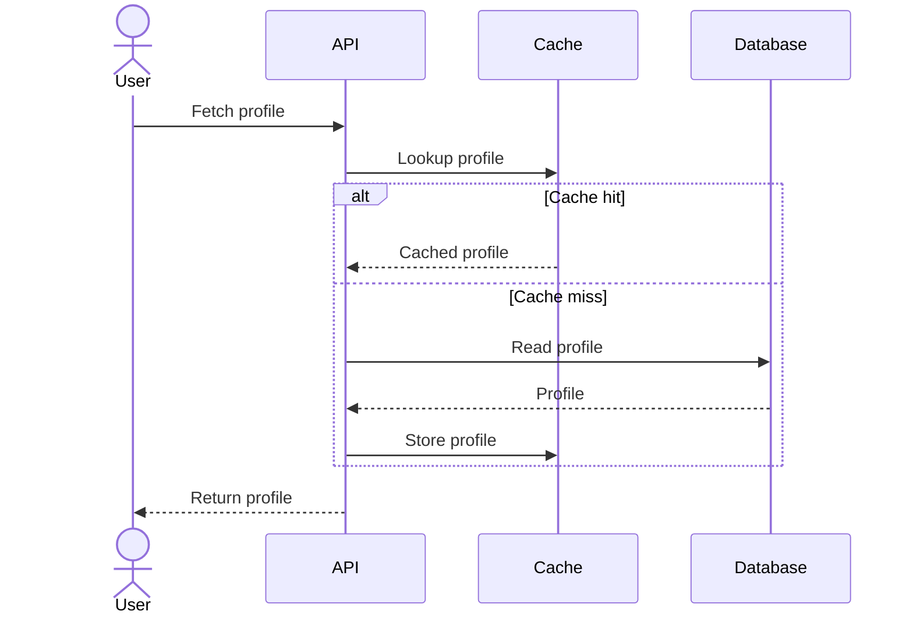
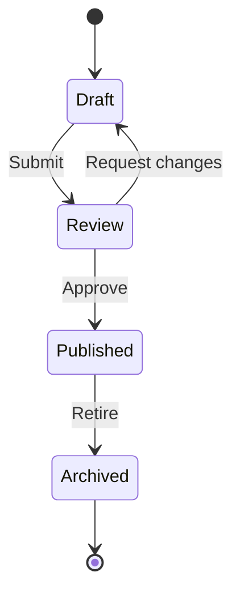
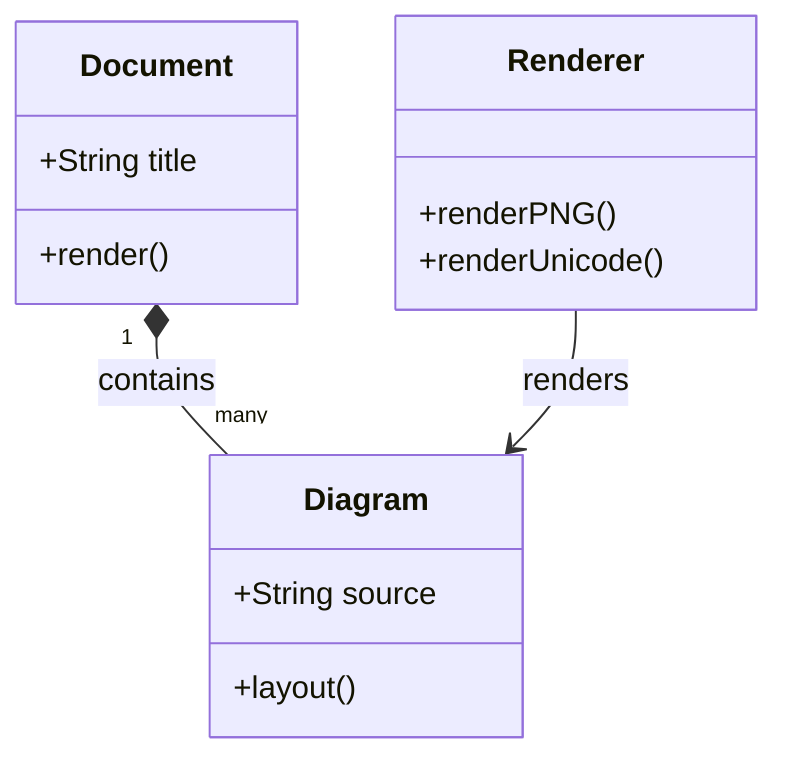
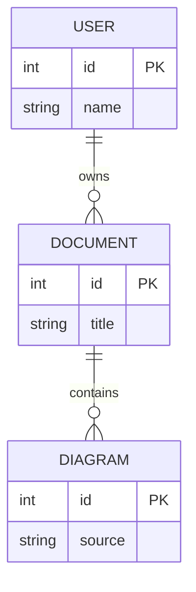
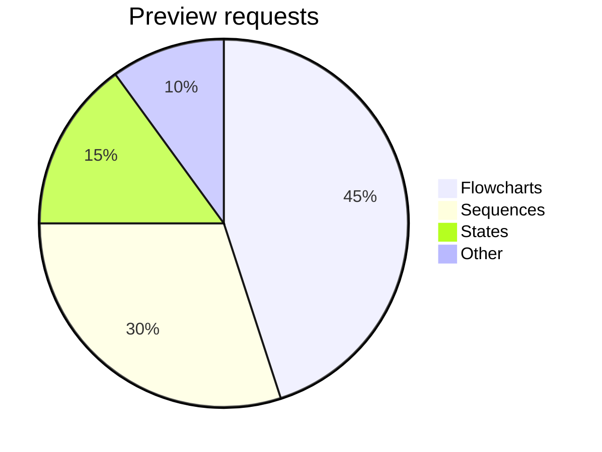

# Mermaid previews

Open this file in Vaayu and press `,mp` for full-screen preview or `,ms` for a
split. Use `j/k` to scroll, `h/l` to pan, `+/-` to zoom graphical diagrams, and
`0` to reset the zoom and pan. Auto mode uses graphical diagrams when the
terminal answers the graphics probe; other terminals show Unicode diagrams.

## Request flow

## Sequence

## State machine

## Classes

## Relationships

## Distribution

